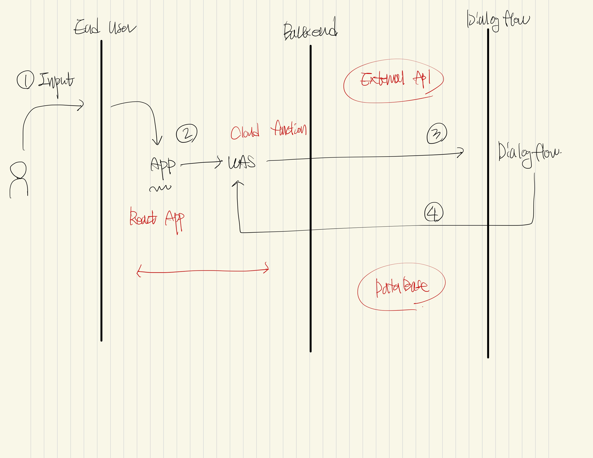

# Chatbot introduce leedonggyu

## Use Subject

- Agent

  - 최종사용자와 동시 실행 대화를 처리하는 가상 에이전트

- Intent

  - 사용자의 대한 의도를 분류
  - 에이전트는 다수의 인텐트를 정의 -> 조합된 인텐트를 사용 -> 전체 대화를 처리

- Entity

  - 각 인텐트의 개체유형을 사용하여 -> 사용자 표현에서 -> 데이터 추출

- Context
  - 대화의 흐름을 제어

## Reference

- https://cloud.google.com/dialogflow/es/docs/quick?hl=ko
